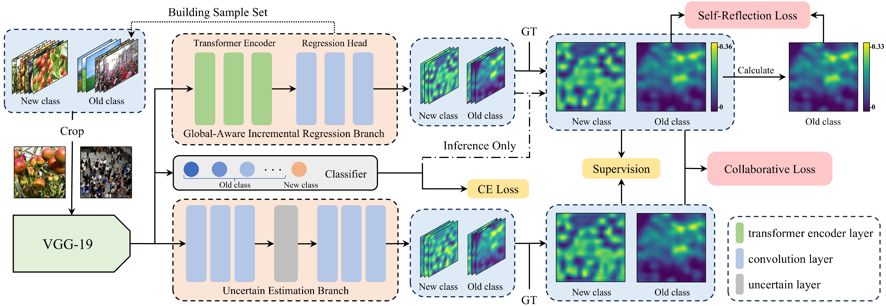

# Self-Reflection Neural Network for Class-Incremental Object Counting

This repository contains the official PyTorch implementation of the paper ["Self-Reflection Neural Network for Class-Incremental Object Counting"](https://doi.org/10.1109/TMM.2025.3613145).

The code was tested with Python 3.8 and PyTorch 1.8.0.

## The network

The self-reflection neural network is designed for class-incremental object counting. It consists of three key components:

1. A **global-aware incremental regression branch** that incrementally predicts density maps for evolving object categories.
2. An **uncertainty estimation branch** that improves the retention of old knowledge and the acquisition of new knowledge by dynamically isolating selected network nodes.
3. A **self-reflection loss** that helps the model revisit previously learned knowledge and improves counting accuracy on old categories.




## Installation


### Create an environment

The released dependency versions are relatively old, so using a dedicated Python 3.8 environment is recommended.

```bash
conda create -n srn-counting python=3.8 -y
conda activate srn-counting
```

### Install dependencies

```bash
pip install -r requirements.txt
```

The training pipeline also imports `torchvision`, `pandas`, and `h5py`. If they are not already present in the environment, install versions compatible with PyTorch 1.8.0:

```bash
pip install torchvision==0.9.0 pandas h5py
```

> **Note:** The first run downloads the ImageNet-pretrained VGG-19 weights used by `models_MAN/vgg_c.py`. Make sure the machine can access the PyTorch model URL, or place the weight file in the local PyTorch cache in advance.

## Dataset preparation

### Directory structure

Organize the dataset as a sequence of incremental stages. Every stage must contain `train_data`, `val_data`, and `test_data` directories:

```text
<DATASET_ROOT>/
├── <stage_1_directory>/
│   ├── train_data/
│   │   ├── images/
│   │   │   └── <class_prefix>_<image_id>.jpg
│   │   └── ground_truth/
│   │       └── <class_prefix>_<image_id>.npy
│   ├── val_data/
│   │   ├── images/
│   │   └── ground_truth/
│   └── test_data/
│       ├── images/
│       └── ground_truth/
├── <stage_2_directory>/
│   ├── train_data/
│   │   ├── images/
│   │   └── ground_truth/
│   ├── val_data/
│   │   ├── images/
│   │   └── ground_truth/
│   └── test_data/
│       ├── images/
│       └── ground_truth/
└── ...
```

Each image must have a same-named `.npy` annotation in the corresponding `ground_truth` directory. For example:

```text
images/car_0001.jpg
ground_truth/car_0001.npy
```


### Annotation format

Training and evaluation use point annotations rather than pre-generated density maps.

- **Training:** an `N x 3` NumPy array. Each row is `[x, y, local_scale]`, where `local_scale` is the mean distance to nearby points and is used during random cropping.
- **Validation/test:** an `N x 2` or `N x 3` NumPy array. Evaluation uses the number of rows as the ground-truth count.
- **Empty annotations:** save an empty array, preferably with shape `(0, 3)` for training data.

Example:

```python
import numpy as np

points = np.array([
    [125.0, 84.0, 21.5],
    [310.0, 190.0, 18.2],
], dtype=np.float32)

np.save("ground_truth/car_0001.npy", points)
```

## Training

Run training from the repository root:

```bash
python main_MAN.py \
  --dataset_dir /path/to/DATASET_ROOT \
  --task 4 \
  --numclass 1 \
  --task_size 1 \
  --batch_size 8 \
  --memory_size 150 \
  --epochs 300 \
  --learning_rate 1e-5
``` 

This project builds upon several excellent open-source works. We gratefully acknowledge: MAN(https://github.com/LoraLinH/Boosting-Crowd-Counting-via-Multifaceted-Attention) and EOCO(https://github.com/Tanyjiang/EOCO)


## Citing Our Method

If you find our method is useful in your project, please consider citing us:

```BibTeX
@article{jiang2025self,
  title={Self-Reflection Neural Network for Class-Incremental Object Counting},
  author={Jiang, Shengqin and Li, Linfei and Cheng, Fengna and Qi, Yuankai and Liu, Qingshan},
  journal={IEEE Transactions on Multimedia},
  volume={27},
  pages={8656 - 8667},
  year={2025},
  doi={10.1109/TMM.2025.3613145},
  publisher={IEEE}
}
```
